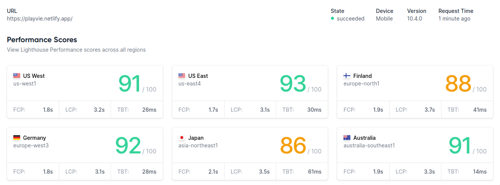
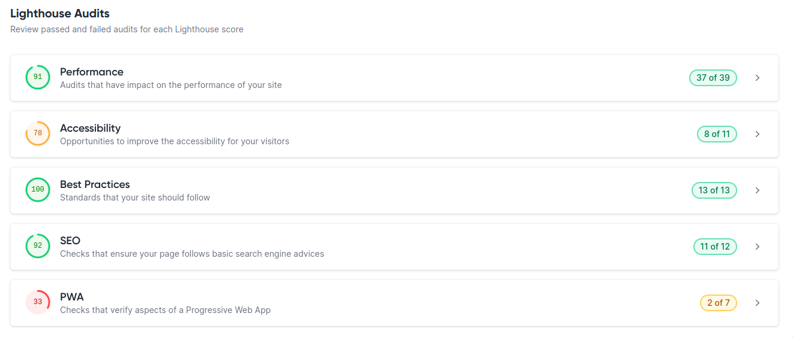

# Video Player application created using React.js to allow users to play videos from a playlist.
## Application hosted on netlify. [Click here](https://playvie.netlify.app/) to see it in action.

### This project is created using React + TypeScript + Vite

#### Features
- Custom Video Player with usual controls
- Playlists and Video timestamps saved to local storage, so you can resume your viewing at any time.
- TailwindCSS used for styling.
- Responsive Design.
- Keyboard functionality to control video playback, playback rate, and volume.
    - `<Space>` or `k` to pause/play
    - `LeftArrow` or `j` to seek -5 seconds
    - `RightArrow` or `l` to seek +5 seconds
    - `UpArrow` to increase volume
    - `DownArrow` to decrease volume
    - `m` to mute volume
- Reorder-able Playlists.
- Next queued video play automatically on video end.
- Playlists
- React Context API used for state management.

#### Lighthouse Scores
[Link to lighthouse page](https://lighthouse-metrics.com/lighthouse/checks/ffc5d968-37d3-4792-ac49-f7ef62adc5e5)



##### Instructions to build and run the application locally:

Clone the repo using `git clone <repo-url>` and cd into the directory using `cd Playvie-react`

Run 
```
pnpm install
pnpm run build
```
or
```
npm install
npm run build
```
to install the dependencies and build the application.
```
pnpm run start
```
or
```
npm run start
```

to start the application.


